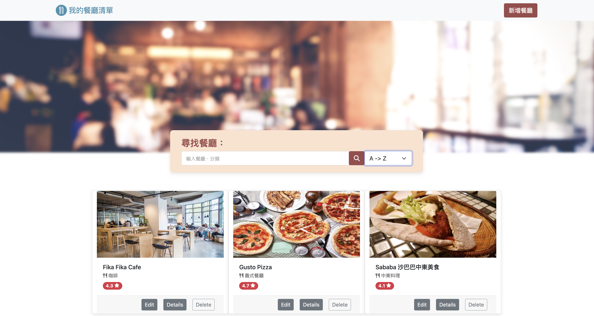

# 我的餐廳清單 My restaurant List
用 Node.js 打造的餐廳清單網站，能擁有一個屬於自己的餐廳清單，可以瀏覽並查看詳細資訊，也可以透過搜尋找到想要的餐廳！




## 功能描述 Features

* 使用者可以註冊帳號
* 使用者可以透過 Facebook 直接登入
* 使用者必須登入才可使用餐廳清單
* 使用者可以在首頁瀏覽全部餐廳
* 使用者可以瀏覽餐廳的詳細資訊並連結地址到 Google map
* 使用者可以搜尋名稱、類別找到特定的餐廳
* 使用者可以設定餐廳排序
* 使用者可以新增餐廳
* 使用者可以編輯餐廳
* 使用者可以刪除餐廳


## 安裝與執行步驟 Installation and Execution
1. 請先確認有安裝 Node.js 與 npm
2. 打開終端機(Terminal)，將專案 clone 至本機位置

```
git clone https://github.com/abbie930/restaurant_list_v3.git
```
3. 進入存放此專案的資料夾

```
cd restaurant_list_v3
```
4. 安裝 npm 套件

```
npm install
```
5. 建立 .env 檔 (參照.env.example)

6. 載入種子資料

```
npm run seed
```
7. 執行

```
npm run dev
```
8. 若看見此行訊息則代表順利運行，打開瀏覽器進入到以下網址

```
Express is listening on http://localhost:3000
```
9. 若要暫停使用，則輸入

```
ctrl + c
```


## 環境建置與需求 Prerequisites

* Node.js 18.12.1
* Express 4.16.4
* Express-handlebars 3.0.0
* MongoDB
* mongoose 5.9.7
* method-override 3.0.0
* express-session 1.17.1
* passport 0.4.1
* passport-facebook 3.0.0
* passport-local 1.0.0