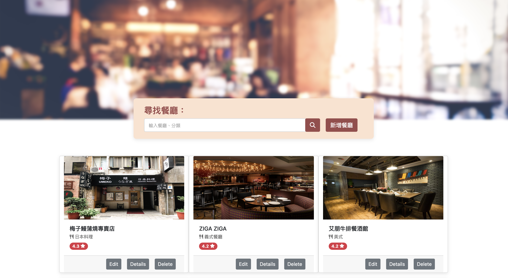

# 我的餐廳清單 My restaurant List
一個餐廳清單網站，可以瀏覽餐廳並查看詳細資訊。




## 功能描述 Features

* 使用者可以查看所有餐廳
* 使用者可以瀏覽餐廳的詳細資訊
* 使用者可以連結餐廳的地址到 Google map
* 使用者可以透過搜尋餐廳名稱、類別找到特定的餐廳
* 使用者可以新增餐廳
* 使用者可以編輯餐廳
* 使用者可以修改餐廳
* 使用者可以刪除餐廳

## 安裝與執行步驟 Installation and Execution
1. 請先確認有安裝 Node.js 與 npm
2. 打開終端機(Terminal)，將專案 clone 至本機位置

```
git clone https://github.com/abbie930/restaurant_list_v2.git
```
3. 進入存放此專案的資料夾

```
cd restaurant_list_v2
```
4. 安裝 npm 套件

```
npm install
```
5. 安裝完成後，輸入

```
npm run start
```
6. 若看見此行訊息則代表順利運行，打開瀏覽器進入到以下網址

```
Express is listening on http://localhost:3000
```
7. 若要暫停使用，則輸入

```
ctrl + c
```


## 環境建置與需求 Prerequisites

* Node.js 18.12.1
* Express 4.16.4
* Express-Handlebars 3.0.0
* Bootstrap 5.1.1
* Font-awesome 6.2.1
* MongoDB
* mongoose 5.9.7

